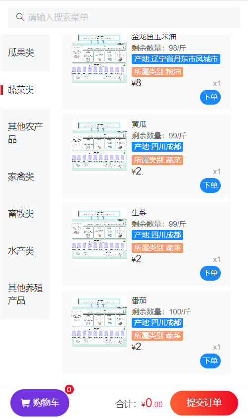
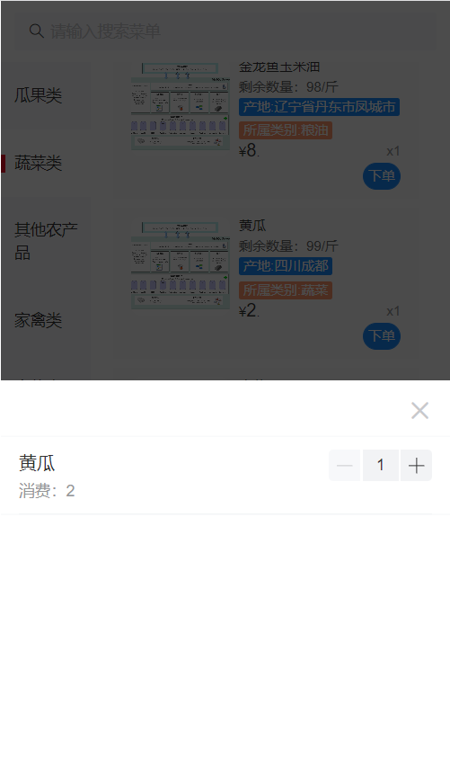
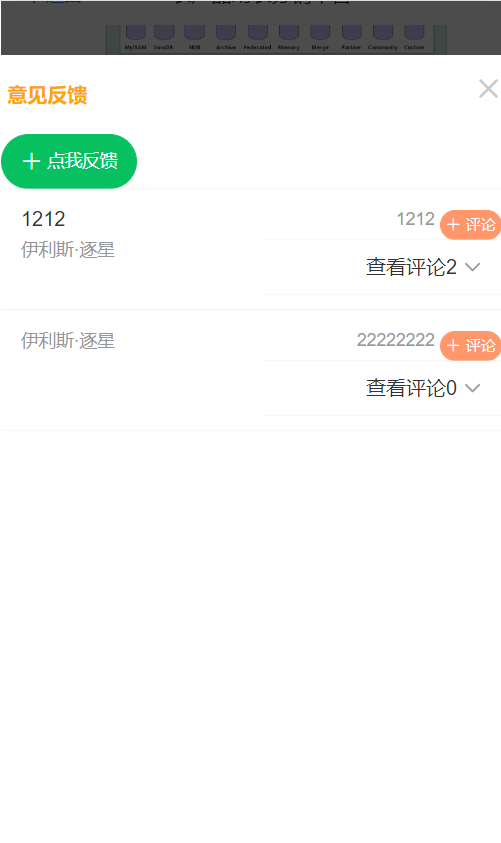
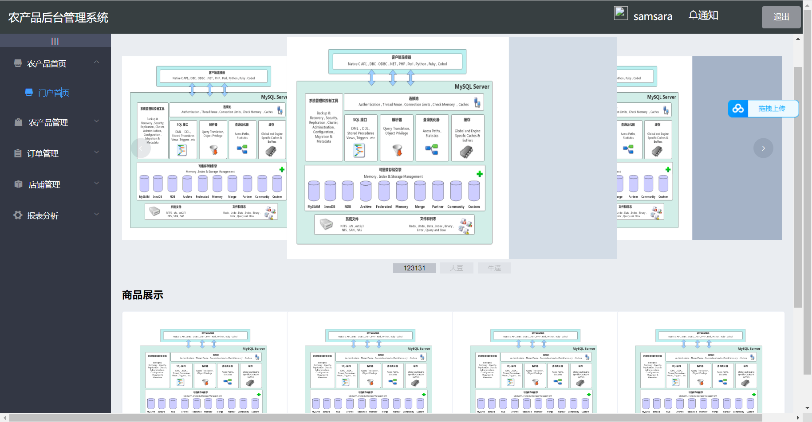
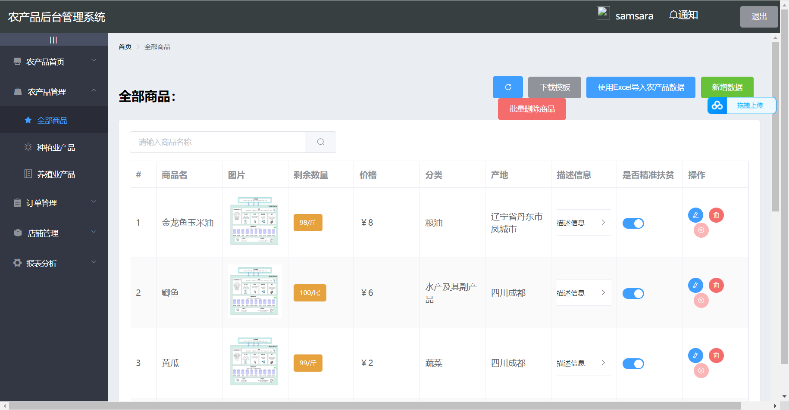
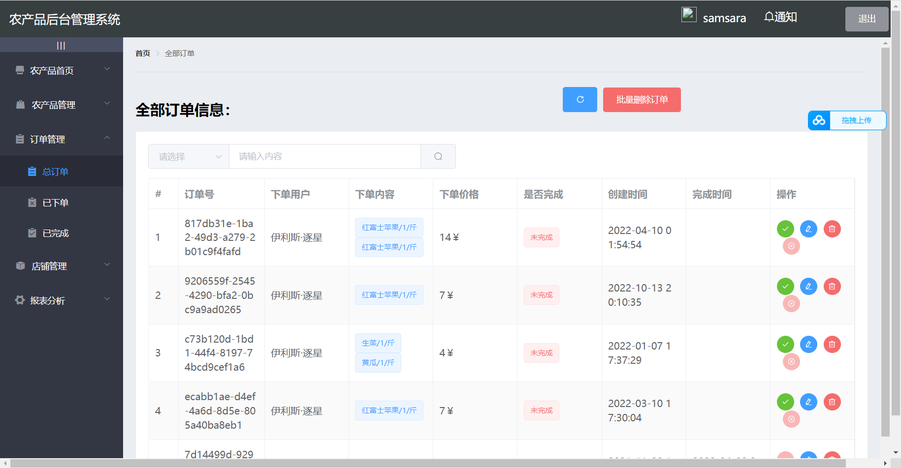
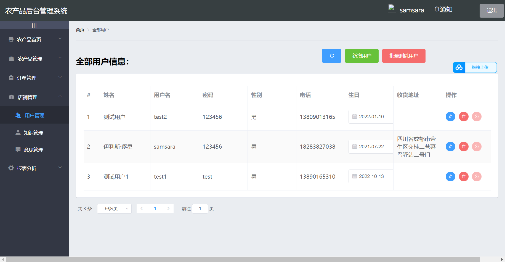
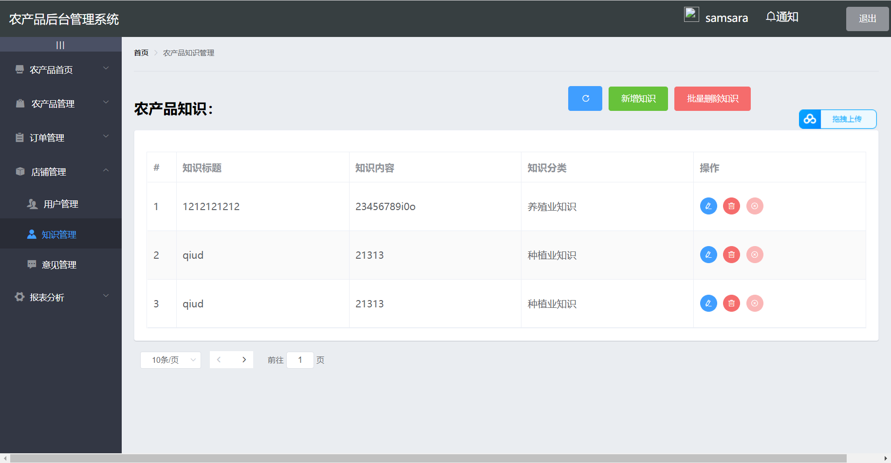
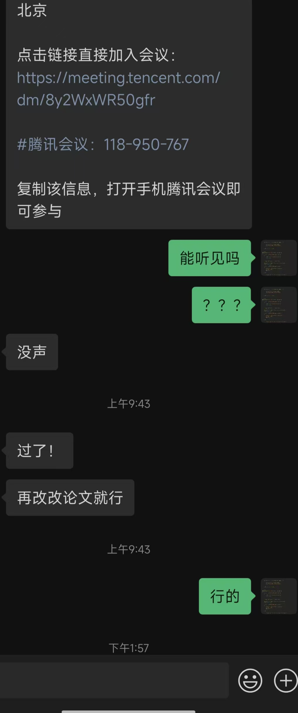
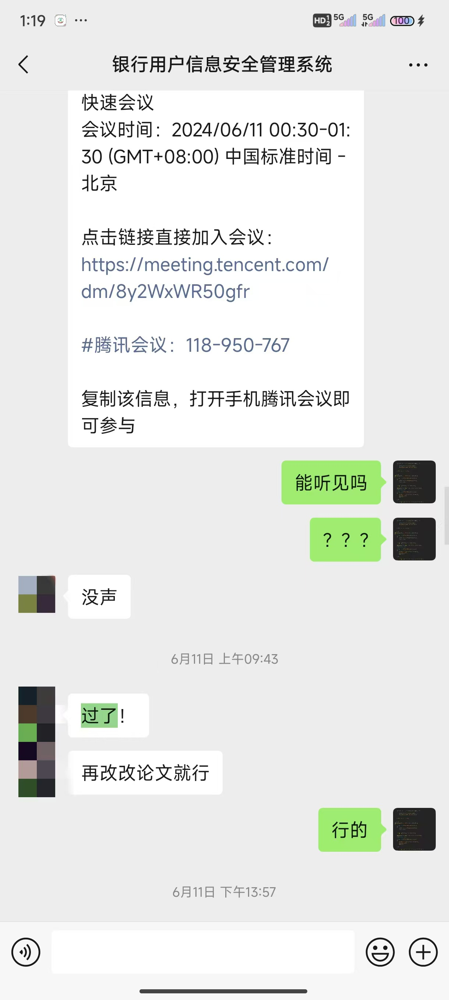

# 基于SpringBoot+Vue的H5农产品销售系统

 **

### 定制调试讲解毕业设计加微信jsjbyzd
** 
🎓【毕业设计选题】、

随着互联网技术的普及，农产品销售迎来了新的发展机遇。一个便捷、高效的H5农产品销售系统对于提升农产品的市场竞争力、促进农民增收具有重要意义。

🛠️【技术栈剖析】

后端：SpringBoot，Java企业级应用的轻量级框架，快速搭建RESTful API，保障服务的高效与稳定。
前端：Vue.js，现代化的JavaScript框架，结合Vuetify等UI库，构建美观、易用的前端界面。
移动端适配：使用H5技术，确保系统在各种移动设备上都能提供良好的用户体验。

🌽【系统功能详解】

产品展示：系统展示农产品的详细信息，包括图片、价格、产地等。
在线下单：用户可以在线浏览产品并下单购买，系统提供购物车和支付功能。
订单管理：系统管理用户的订单信息，包括订单状态、物流跟踪等。
用户反馈：用户可以对购买的产品进行评价和反馈，帮助提升产品质量。
数据分析：系统提供销售数据分析，帮助农民了解市场需求，优化种植策略。

  
  
  
  
  
  
  
  

 **

### 学生案例
** 

